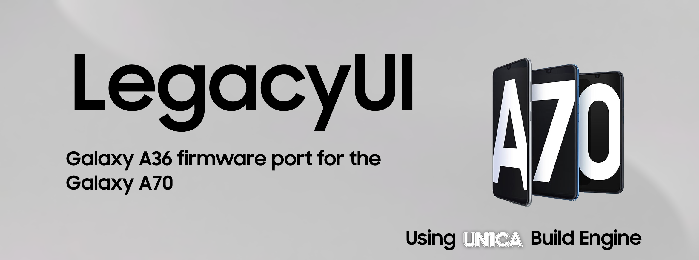

<h1 align="center">
  
</h1>

LegacyUI is a fork of UN1CA for the Galaxy A70

# Base:
LegacyUI aims to bring in a pure OneUI implementation with UN1CA Core patches applied
Unlike it's parent project and other forks, LegacyUI focuses on a pure reimplementation of the Galaxy A36 firmware on the Galaxy A70.
It does not focus on bringing full features but a basic framework that allows the device to enjoy a higher API level while keeping many of it's proprietary functions working at most.

# Phones Supported:
- Galaxy A70 International (SM-A705FN)
- Galaxy A70 International non-NFC (SM-A705F) (Must disable NFC after setup)
- Galaxy A70 LATAM (SM-A705MN)
- Galaxy A70 China (SM-A7050)
- Galaxy A70 India (SM-A705GM)

* Some revisions use NXP PN553 which is unsupported by OneUI 7 or later. If NFC doesn't launch with an NFC model that means your phone uses that unsupported model and you must disable NFC

# Licensing:
UN1CA's build engine abides to the GPLv3 license like the original project. Same applies for LegacyUI.

# Credits
LegacyUI:
- **[Tisenu100](https://github.com/tisenu100)** the Master Kanger
- **[rtd1250](https://github.com/rtd1250)** for the main Galaxy A70 support device trees
- **[Pascua](https://github.com/pascua28)** for his work upstreaming & improvising the SM6150 kernel via Prime
- **[ExtremeXT](https://github.com/ExtremeXT)** for the Bluetooth Patch Upstream & his contributions on documenting the OneUI 7+ framework
- **[Peter Knecht](https://github.com/PeterKnecht93)** for assisting on cameradata bringup for legacy devices
- **Samsung SM6150 Team** for their support on keeping the device & all Samsung SM6150 devices alive

UN1CA Build engine by:
- **[Salvo](https://github.com/salvogiangri)** project founder and developer of the build system

# Honorable Mentions
- **[A70Q-Lineage](https://github.com/a70q-lineage/)** Sources for AOSP bringup on the Galaxy A70. Now merged with official LineageOS trees
- **[ProjectNERV](https://github.com/yagzie/NERV)** Formerly active and allied with LegacyUI project
- **[ExtremeROM](https://github.com/ExtremeXT/ExtremeROM)** An S24 FE firmware port for the Galaxy S10 & other Exynos series devices

# Kernel Sources
**[Kernel Source](https://github.com/pascua28/android_kernel_samsung_sm7150)**
Prime Kernel by Pascua
